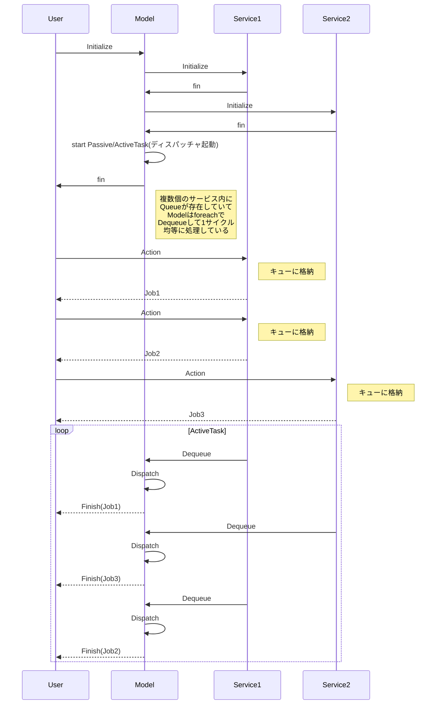

Queue Machine仕様
---
　ジョブ単位の並列処理を実行するモジュール群

 例：
 　１つのシリアルポートに複数のデバイスが接続されている時は１：Nの関係なので、同時アクセス問題は起きないが、
逆に複数のデバイスがシリアルポートに同時アクセスを行った時、N:1の関係となり、シリアルポートで競合が発生してしまう。
これをキュー処理を導入する事で１：１の関係に変換して競合を起こさないようにするのが本モジュールの目的である。

以前はシリアルポート自身に１つのキューを実装していたが、N:1のアクセスで偏ってしまっていた場合、１つのデバイスに占有されてしまう問題を回避すべく、N:1の１つ１つの関係にキューを持たす事で、全デバイスが均等にシリアルポートにアクセスできるようにした。

Job並列処理シーケンス図
---

